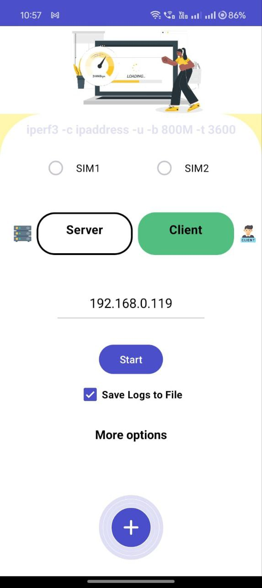
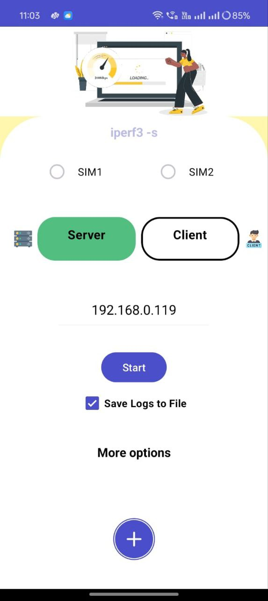
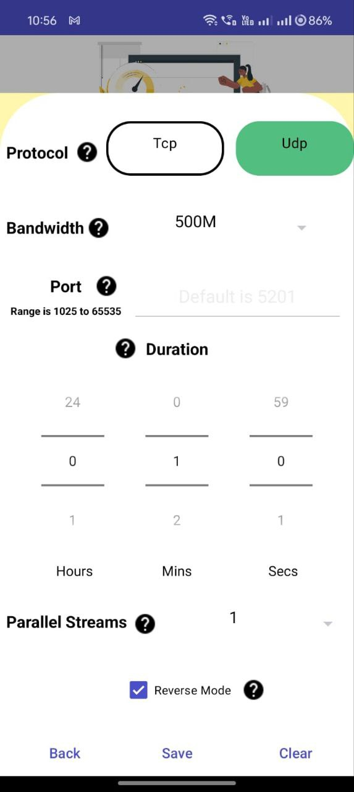
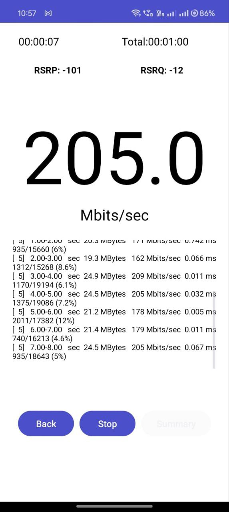
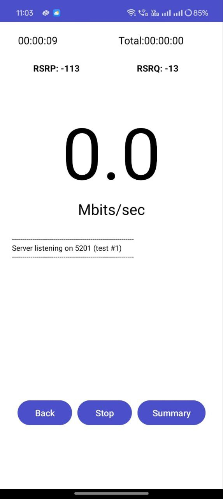
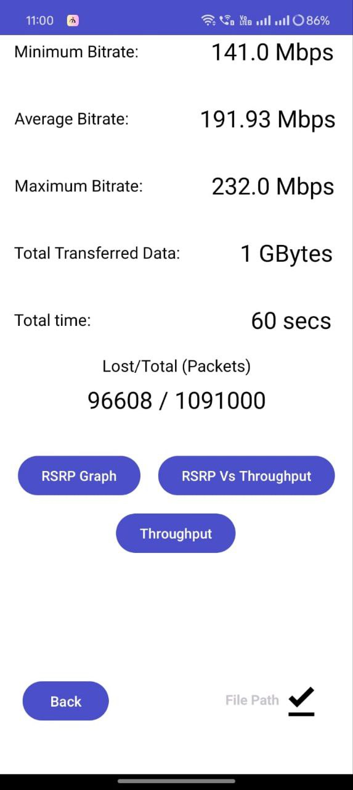
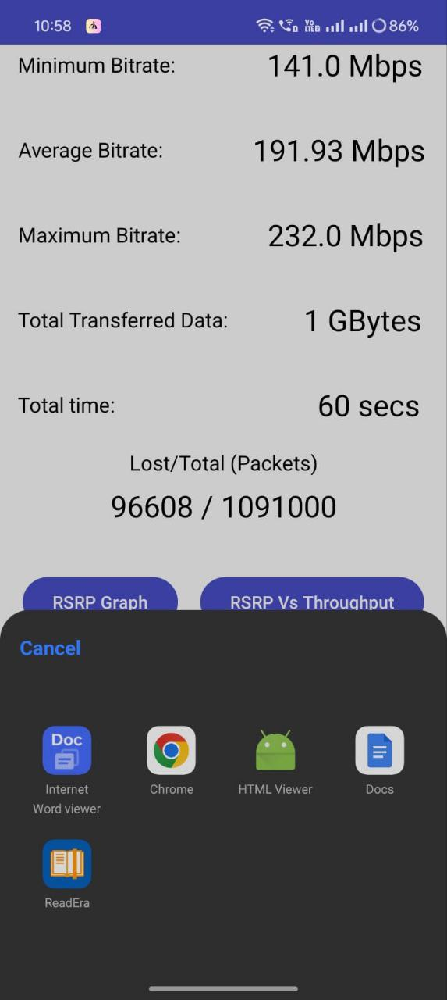
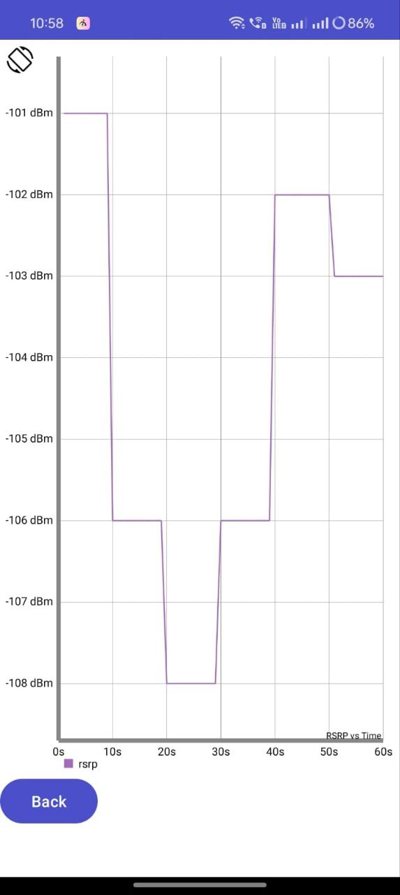
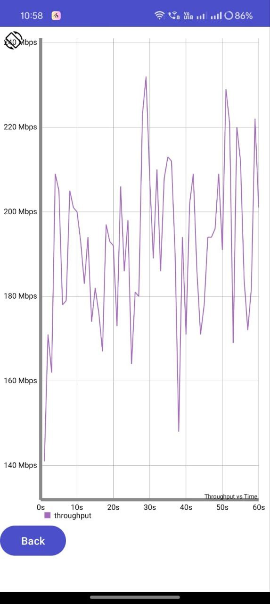
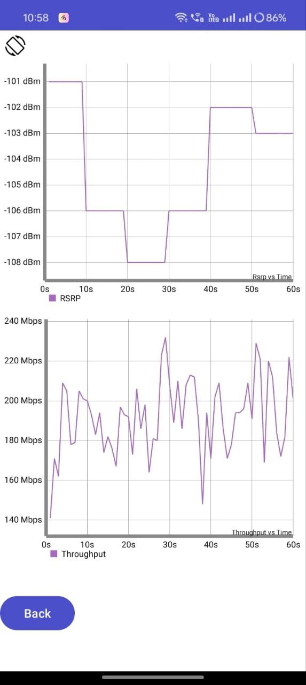

# Perfgrine

### About app

This App is an advanced Android application designed to meticulously evaluate the throughput of diverse network types, including 5G, Wi-Fi, and cellular connections.    

• Full GUI-based interface for ease of use.  

• Improved visibility of throughput numbers. 

• Provides detailed logs and essential performance metrics. 

• Allows easy configuration of testing parameters such as test duration, server IP address, bandwidth allocation, protocol selection, and number of parallel streams. 

• Conducts network tests for 4G and 5G networks. 

• Generates traffic according to specified parameters and analyzes resulting throughput. 

• Presents essential performance metrics with bitrate prominently displayed for quick assessment of network speed. 

### Usage

• Launch the application. 

• You can either choose Server or Client according to your requirement. 

• If you choose server ,then your mobile acts as a server and you can start the test . 

• If you choose client , then your mobile acts as a client. Before starting your test , start iperf at your server side.  

• Use the intuitive GUI interface to configure testing parameters such as test duration, server IP address, bandwidth allocation, protocol selection, and number of parallel streams. 

• Start the test and monitor the progress. 

• Or else , after entering your server Ipaddress you can click start button , where the app will run default command and begin the test. 

• Once the test is complete, review the detailed logs and essential performance metrics provided by the application on the summary screen. 

• Analyze the resulting throughput, with bitrate prominently displayed for quick assessment of network speed. 

### Configuration

Network Testing Tool allows easy configuration of various parameters to tailor tests according to specific requirements. These parameters include:

• Test duration  
• Server IP address  
• Bandwidth allocation  
• Protocol selection  
• Number of parallel streams  

### Screenshots

 
 

      
 

### Contact

For any inquiries or feedback, please contact us at perfgrine@gmail.com.

